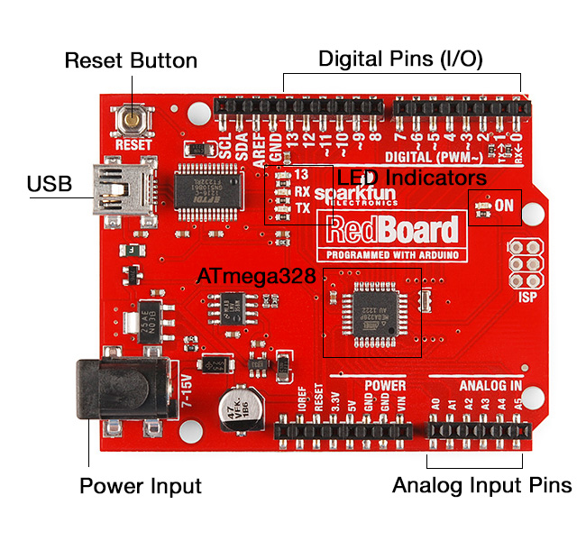
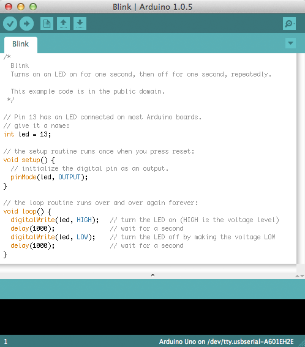

# Arduino Introduction

The Arduino is an open-source electronics prototyping platform that utilizes an 8-bit (in the case of the UNO) Atmel AVR micro-controller, coupled with a software development environment, compiler, and bootloader. Arduino started out as a university project in Italy in 2005. One of the main goals of the Arduino developers was to make hardware development less expensive and more easily accessible. By making the platform open-source they have done that well. Today, Arduinos comes in many sizes and shapes, from different manufacturers. Arduino makes it easy to create devices that interact with the physical world. They are used extensively by designers and hobbyists. There are tons of great sources for information online, and lots of great code libraries freely available.

## Arduinio Board Layout

This image below depicts a SparkFun RedBoard Arduino, which we will be using for our lessons. The board layout is similar to that of the Arduino UNO R3, with a few key differences. First, the RedBoard Arduino uses a surface mount version of the ATmega328. Next, the RedBoard Arduino uses FTDI for USB (like the Arduino Duemilanove) instead of native USB in order to provide better compatibility.

## Other Arduino Flavors

[https://www.sparkfun.com/pages/arduino_guide](https://www.sparkfun.com/pages/arduino_guide)

## Arduino Integrated Development Environment (IDE)

The Arduino IDE is written in Java and is based on other open-source software including Processing and avr-gcc. The IDE is available for Window, OSX, and Linux.

Proceed the the Arduino software download page using the following link:

[http://arduino.cc/en/main/software](http://arduino.cc/en/main/software)

You may also need to download the FTDI USB drivers here:

[http://www.ftdichip.com/Drivers/VCP.htm](http://www.ftdichip.com/Drivers/VCP.htm)

You can now follow the platform specific install instructions found here:

[http://arduino.cc/en/Guide/HomePage](http://arduino.cc/en/Guide/HomePage)

Once you have the IDE installed and configured we will run the Blink example together.

## Great Arduino Resources

- [AdaFruit Industries](http://learn.adafruit.com/): Arduino tutorials and great place for electronic parts.
- [Arduino Cheatsheet](https://dlnmh9ip6v2uc.cloudfront.net/learn/materials/8/Arduino_Cheat_Sheet.pdf): One page Arduino guide from SparkFun.
- [Arduino Homepage](http://arduino.cc/en/): The main source for Arduino info.
- [Bildr Blog](http://bildr.org/): Lots of neat Arduino examples.
- [Fritzing](http://fritzing.org/download/): Software for drawing circuits.
- [MIT High Low Tech Labs](http://hlt.media.mit.edu/?p=1695): Run Arduino on an ATtiny44/84 or ATtiny45/85.
- [OSH Park](http://oshpark.com/): Not Arduino specific, but a affordable place to get PCB's made.
- [SparkFun Electronics](https://learn.sparkfun.com/): Free learning material on Arudino and electronics. Also a great resource for electronic parts.

Copyright © 2018 Turner Logic, LLC